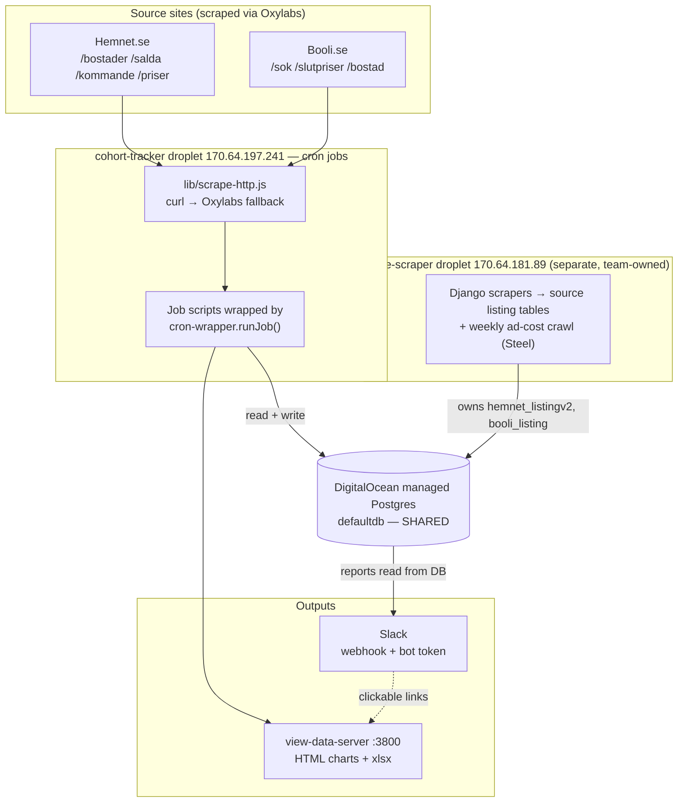

# Hemnet Cohort Tracker — Operator Handover (Master Overview)

**Prepared:** 2026-07-28 · **Audience:** whoever is taking over day-to-day operation of this system.

This is the **single document to read first**. It explains what the system is, why it exists, how
the pieces fit together end-to-end, what runs when, and what you have to do to keep it alive. Three
companion deep-dives go one level down — read them when you need detail:

| Deep dive | When to read it |
|---|---|
| [`02-DATA-STREAMS-AND-JOBS.md`](02-DATA-STREAMS-AND-JOBS.md) | Every scraper/job in detail: what it pulls, from where, how, what it writes, how to run it by hand. |
| [`03-INFRASTRUCTURE-AND-OPERATIONS.md`](03-INFRASTRUCTURE-AND-OPERATIONS.md) | Droplets, database, secrets, Oxylabs cap, deploy, cron, monitoring, disk. |
| [`04-REPORTING-AND-SLACK.md`](04-REPORTING-AND-SLACK.md) | Every Slack report and chart/export artifact, and how to dry-run safely. |

The **authoritative operational runbook** is the repo-root file [`deploy-instructions.md`](../../deploy-instructions.md)
(~45 KB, per-job failure modes). The three deep-dives summarise and cross-reference it. There is also a
refreshed technical map under [`.planning/codebase/`](../../.planning/codebase/) (`STACK`, `ARCHITECTURE`,
`STRUCTURE`, `CONVENTIONS`, `TESTING`, `INTEGRATIONS`, `CONCERNS`).

---

## 1. What this is (in one paragraph)

A **Swedish-property data pipeline** that measures supply and demand across the two dominant listing
portals, **Hemnet** and **Booli**. It self-hosts scrapers that populate source listing tables, builds
weekly "cohorts" of for-sale listings and tracks how their **view counts** grow on each platform,
matches **sold** records between the two portals to estimate Hemnet's true market share, captures
daily **nationwide supply totals**, and measures **pre-market flow** and **listing age**. Everything
runs as unattended cron jobs on a DigitalOcean droplet, against a managed Postgres database, with all
scraping routed through the **Oxylabs** proxy, and results posted to **Slack**.

**Why it exists (the thesis):** quantify the Swedish housing funnel — the *pool* (what's for sale /
sold) and the *flow* (how it moves) — across **both** platforms, because either one alone understates
the market (Booli's pool is ~19% larger for-sale and ~5× larger pre-market than Hemnet's). The
cross-platform comparison is the differentiator. A separate strand tracks what Hemnet **charges
sellers to advertise** (ad-cost), as a direct read on Hemnet's pricing power.

The project has shipped through v1.0 → v5.0 (cohort MVP → self-hosted scrapers → market-supply pulse →
spot-check QA → sold-match pipeline → price-scraper infra → ad-pricing). The current milestone (v5.0)
is resuming the Hemnet ad-cost scrape and building its weekly reporting.

---

## 2. The system at a glance

**The load-bearing idea:** almost nothing talks directly to a site. Jobs call `lib/scrape-http.js`,
which tries a direct `curl` and **transparently falls back to Oxylabs** on a Cloudflare block. On the
droplet the datacenter IP is permanently blocked, so in practice **~100% of traffic goes through
Oxylabs** (`SCRAPE_FORCE_OXYLABS=1`). Every scheduled job is wrapped by `cron-wrapper.runJob()`, which
logs a row to the `cron_job_log` table and posts a Slack alert if the run ends in warning/failure.
Reports are pure **database reads** → Slack; they never scrape.

---

## 3. The six data streams

Each stream is a group of jobs. This is the mental model; job-by-job detail is in
[`02-DATA-STREAMS-AND-JOBS.md`](02-DATA-STREAMS-AND-JOBS.md).

### (a) Cohort view-tracking — *the original product*
Every week, discover new **for-sale** listings on Booli (4 counties), find their Hemnet twins, and
form a "cohort" of matched Booli↔Hemnet pairs. Then, every 2 days, re-scrape each listing's **view
count** and append a time-series row. This measures **Hemnet's view dominance** — Hemnet gets ~3–4.5×
the incremental views Booli does for the same property. Core tables: `cohorts`, `cohort_pairs`,
`cohort_daily_views`. Jobs: `booli-targeted-discovery.js` (Job C), `hemnet-targeted-match.js` (Job B),
`cohort-create.js`, `booli-targeted-refresh.js` (Job D), `hemnet-targeted-refresh.js` (Job A),
`cohort-track.js`.

### (b) Sold-match — *Hemnet's true market share*
Every fortnight, sample ~1,000 recently **sold** Booli records nationally and try to find each one on
Hemnet's sold index (`/salda`), with a Google-search "bridge" fallback. What can't be matched after a
~4-week re-check window is **genuine non-Hemnet** — a real sale that never appeared on Hemnet. Headline
finding: ~36% of Booli *villa* sold records are genuinely absent from Hemnet. Core tables: `booli_sold`,
`hemnet_sold`, `sold_match`. Orchestrator: `sold-match-batch.js` (Mon 07:30, even weeks only).

### (c) Market supply totals — *the daily pulse*
Every day, capture the **nationwide headline count** of listings For Sale (Till salu) and pre-market
(Kommande) on both sites — just 3 Oxylabs requests/day for 4 numbers. Shows the total market size and
the Booli-vs-Hemnet supply gap. Table: `market_totals`. Job: `market-totals-daily.js`.

### (d) Pre-market flow — *how fast new supply appears*
Every week, walk each site's "Kommande/upcoming" pool newest-first and count how many **new** second-
hand listings appeared in the last 7 days, plus how stale the pool is (mean dwell). Table:
`premarket_flow_weekly`. Job: `scripts/premarket-flow-measure.js` (Mon 08:50).

### (e) Age-penetration censuses — *one-off analyses, not scheduled*
Ad-hoc tools that measure the **age distribution** of the for-sale / pre-market pool (how many listings
are fresh vs zombie). **These are manual research scripts** — not in cron, no DB writes; they dump
JSON/Markdown to `verf-flow-probe/`. Run them only when you want a fresh age census. Scripts:
`scripts/*-age-census.js`, `scripts/forsale-age-penetration.js`.

### (f) Ad-cost — *Hemnet's seller pricing power (lives on the OTHER droplet)*
Scrapes Hemnet's seller price calculator (`/priser`) — what Hemnet charges to list a property, by
municipality and price band. This runs on the **separate price-scraper droplet** using a **Steel.dev**
headless browser (not Oxylabs), because the calculator is behind Cloudflare Turnstile. The *reporting*
half is meant to live in this repo (Phase 28) but is **built-but-not-yet-wired-to-Slack**. Scripts:
`scripts/crawl-adcost.js`, `scripts/adcost-report.py`.

> Plus a cross-cutting **(g) QA / health** layer: the weekly spot-check gate that visually confirms
> Booli↔Hemnet pairs are the same property (dHash + optional Claude vision + a human Slack review
> queue), and the daily cron-health monitor.

---

## 4. Infrastructure at a glance

Full detail in [`03-INFRASTRUCTURE-AND-OPERATIONS.md`](03-INFRASTRUCTURE-AND-OPERATIONS.md).

**Three droplets — do not confuse them:**

| Droplet | IP | Role |
|---|---|---|
| **cohort-tracker** ("the Hemnet box") | `170.64.197.241` | **Runs this repo.** All cron jobs in this handover fire here from `/opt/hemnet-cohort-tracker`. |
| **price-scraper** | `170.64.181.89` | Separate team-owned Django box. **Produces the source listing tables** this repo reads, and runs the **ad-cost** crawl. |
| **monitor-prod-syd1** | `209.38.93.133` | Unrelated fintech monitor. **No Hemnet work.** Listed only so you don't chase it. |

**Database:** DigitalOcean **managed Postgres**, database `defaultdb`, port `25060`, user `doadmin`,
SSL required. Connection is built in `db.js` from **discrete env vars** `DB_HOST / DB_PORT / DB_USER /
DB_PASSWORD / DB_NAME` (⚠ note: `deploy-instructions.md` mentions `DATABASE_URL`, but the code path
every job uses reads the discrete `DB_*` vars — set those). The DB is **shared** with the price-scraper
Django app; treat its source tables (`hemnet_listingv2`, `booli_listing`) as a read-only external API.
The droplet has **no `psql`** — query prod with a committed Node script using `db.js`.

**Scraping proxy:** **Oxylabs** (`realtime.oxylabs.io/v1/queries`), Advanced plan. Auth via
`OXYLABS_USERNAME` / `OXYLABS_PASSWORD`. **Monthly cap ≈ 262k non-JS requests; utilisation ~86%** — the
single biggest recurring constraint. Check month-to-date at `data.oxylabs.io/v1/stats` **before any
geographic expansion.**

**Slack:** two **separate** integrations (see §5).

**Secrets:** all in a git-ignored `/opt/hemnet-cohort-tracker/.env` on the droplet (`.env.example` is
the template — but note it's incomplete; `SLACK_BOT_TOKEN` and `STEEL_API_KEY` are missing from it).

**Deploy:** commit → push to `master` → `git pull` on the droplet → cron picks up new code next run.
No automated CI deploy (a GitHub Actions workflow exists but is a legacy secondary path; the droplet
cron is production). If a pull introduces a `migrate-*.js`, run it by hand.

---

## 5. How results reach humans (Slack)

Full detail in [`04-REPORTING-AND-SLACK.md`](04-REPORTING-AND-SLACK.md). There are **two Slack
transports and they are not interchangeable:**

- **Incoming webhook** (`SLACK_WEBHOOK_URL`, text-only) → the **"Hemnet Status"** channel. Carries all
  the automated pulses and alerts: cron failure/warning alerts, the daily health report, the weekly
  cohort-view / market-supply / pre-market-flow posts.
- **Bot token** (`SLACK_BOT_TOKEN`, `chat:write` + `reactions:read`) → the **review channel**
  (`SLACK_REVIEW_CHANNEL` / `SOLD_MATCH_SLACK_CHANNEL`). Carries the interactive spot-check review queue
  (you react ✅/❌/❓ and a poller applies your verdict) and the sold-match match-rate summary.

Charts and workbooks (`.html`/`.xlsx`) are written to `view-data/<date>/…` and served by
`view-data-server.js` on **port 3800**; the Slack posts link to them as clickable full URLs.

> ⚠ **Critical dry-run gotcha:** every script calls `dotenv`, which **re-injects the Slack token from
> `.env`** — so `env -u SLACK_BOT_TOKEN node …` does **NOT** stop the post; it still posts for real. To
> genuinely dry-run, use a script's `--smoke` mode, run where `.env` lacks the token (e.g. your local
> machine), or read the `console.log` the script prints before posting. See
> [`04-REPORTING-AND-SLACK.md §1`](04-REPORTING-AND-SLACK.md).

---

## 6. The weekly rhythm (what fires when, all times UTC)

The whole system is a clock. This is the timeline; confirm against the live crontab (`crontab -l` on
the droplet) before trusting exact minutes — the docs have drifted before.

**Sunday**
- `22:00` — **Booli discovery** (Job C): find the week's new Booli for-sale listings.

**Monday (cohort build + all weekly reports)**
- `03:00` — **Hemnet match** (Job B): find the Hemnet twins. *(must run after Job C)*
- `06:00` — **Cohort create**: form the week's matched-pair cohort (DB only).
- `06:30` — **Spot-check gate**: QA the new cohort, post the review queue.
- `07:30` — **Sold-match batch** *(even ISO weeks only)*: the fortnightly national sold run.
- `08:50` — **Pre-market flow measure**.
- `09:30 / 09:35 / 09:40` — weekly **view report / market-supply pulse / pre-market flow pulse** → Slack.
- `11:00 / 11:05 / 11:10` — **sold-match report / trend chart / audit xlsx**.

**Every 2 days (odd days of month)**
- `14:00` — **Job A + Job D** (Hemnet + Booli view refresh, in parallel).
- `22:00` — **Cohort track**: append the day's view time-series. *(must run after A+D)*

**Daily**
- `03:00` — **cron-health-slack**: daily health report → Slack.
- `08:00` — **SFPL region snapshot** (inventory stock counts).
- `08:30` — **Market-totals daily** (the 4-number supply pulse).
- `12:00` — **Spot-check reaction poller**: apply human ✅/❌ verdicts.

Ordering dependencies that matter: **C → B → cohort-create**, and **A+D → cohort-track**.

---

## 7. New-operator runbook

### Day 1 — establish ground truth
1. **SSH to the box:** `170.64.197.241`, code at `/opt/hemnet-cohort-tracker`.
2. **Confirm `.env`** has `DB_*`, `OXYLABS_USERNAME/PASSWORD`, `SLACK_WEBHOOK_URL` set (and, for the
   review queue, `SLACK_BOT_TOKEN` + `SLACK_REVIEW_CHANNEL` + `SLACK_ALLOWED_REACTORS`; for sold-match,
   `MAX_OXY_CALLS=8000`).
3. **Confirm prod = origin:** `git -C /opt/hemnet-cohort-tracker rev-parse HEAD` vs
   `git log origin/master`. (Deploy drift is a known recurring problem — see §8.)
4. **Check recent job health:** `node scripts/verify-cron-job-log.js` — every job should have recent
   rows, none `failure` or "NO ROWS in 14 days".
5. **Join and watch the "Hemnet Status" Slack channel.** Confirm the daily 03:00 health report arrives.
6. **Check the Oxylabs budget:** month-to-date via `data.oxylabs.io/v1/stats` against the 262k cap.
7. **Read [`deploy-instructions.md`](../../deploy-instructions.md) end-to-end.**

### Every week
- Skim the Monday Slack posts (view report, supply pulse, flow pulse, sold-match).
- **Action the spot-check review queue** in the review channel: react ✅ (confirm mismatch — removes the
  pair), ❌ (valid match — keep), ❓ (unsure). Only reactions from `SLACK_ALLOWED_REACTORS` count.
- Glance at Oxylabs usage trending toward the cap.

### When something breaks
- A **Slack alert** fires → open `deploy-instructions.md` §Runbook (per-job failure modes) and check
  `/var/log/hemnet/<job>.log` + `node scripts/verify-cron-job-log.js`.
- **No news is not proof of health** — a missing `SLACK_WEBHOOK_URL` or a silently-dead job produces
  silence. The daily health report and `cron_job_log` are the real source of truth.
- **Re-running a long job:** always use `tmux` or `nohup … & disown`. A bare console disconnect can
  orphan a `running` row in `cron_job_log`.
- **Never launch a paid Oxylabs run without explicit approval** for that specific run — offline
  `--smoke` tests and existing CSVs are free.

### Manual runs & safe dry-runs
- Every job runs by hand as `node <script>.js` (exact commands and flags are in
  [`02-DATA-STREAMS-AND-JOBS.md`](02-DATA-STREAMS-AND-JOBS.md)).
- Safe **offline** self-tests (no DB, no network, no Slack):
  `node sold-match-report.js --smoke`, `node sold-match-trend-chart.js --smoke`,
  `node sold-match-xlsx.js --smoke`, `node lib/spotcheck-slack-bot.js --smoke`,
  `node sold-match-batch.js --smoke`.

---

## 8. Top operational risks (the things that will page you)

Ordered by likelihood; full analysis in [`.planning/codebase/CONCERNS.md`](../../.planning/codebase/CONCERNS.md).

1. **Oxylabs monthly cap breach** — ~86% of ~262k used; any county/municipality expansion multiplies
   calls. *Always model the delta and check `data.oxylabs.io/v1/stats` first.* Levers: `MAX_OXY_CALLS`,
   `RECHECK_BRIDGE_FINAL_ONLY=1`.
2. **Droplet disk exhaustion** — hit 100% on 2026-07-27 (a job crashed with ENOSPC). Freed to ~68%, a
   retention cron installed, but a durable cache cap is still deferred. *Check `df -h` before big runs.*
3. **Dead credentials / dead endpoints** — this system has a recurring pattern of external paths dying
   silently (Hemnet direct-curl died → all-Oxylabs; the price-scraper box's *own* Oxylabs creds went
   401; the ad-cost GraphQL op died and was re-ported to Steel). *Assume any external path can die;
   run a `probe-oxylabs-*.js` canary before big runs.*
4. **Silent cron failures** — alerts depend on `SLACK_WEBHOOK_URL` being set, and successful re-checks
   are silent. *Use `cron_job_log` + the daily health report, not Slack silence, as truth.*
5. **Local ≠ origin ≠ droplet deploy drift** — deploy is "git pull on the droplet", and history has
   diverged before (once 42 commits behind; a fortnight-interlock fix is committed-but-not-deployed).
   *Establish git ground truth before every deploy; reconcile the age-census branches by rebase.*

**Security items to close (from the audit):**
- 🚨 **`verf-24-backup/` contains committed infra secrets** (`authorized_keys.bak`, crontab/iptables
  dumps of the price-scraper box) tracked in git history. Purge from history (`git filter-repo`) and
  rotate any exposed keys.
- Oxylabs and DB credentials are **shared across two boxes and un-rotated** after the price-scraper
  box's (remediated) malware incident. A dedicated rotatable Oxylabs sub-user per box is an open
  follow-up.

**Known outstanding data cleanups:** 86 stale "no-photos" UNCERTAIN spot-check rows from the W27
incident; ~49 GB of dead `simple_history` bloat on the shared DB.

---

## 9. Where everything lives (repo map)

| Location | What's there |
|---|---|
| Root `*.js` (e.g. `cohort-*.js`, `*-targeted-*.js`, `market-totals-*.js`, `sold-match-*.js`) | The **scheduled job scripts** — each is a cron entry point wrapped by `cron-wrapper.runJob`. |
| `lib/` | Shared modules: `scrape-http.js` (transport), `sold-*.js` (sold-match engine), `spotcheck-*.js` (QA/vision/Slack), `premarket-flow.js`, `hemnet-locations*.json`. |
| `scripts/` (~70 files) | Manual tools, probes, one-off analyses, and a few scheduled helpers (`premarket-flow-measure.js`). Many `probe-*.js` are investigation scaffolding, not production. |
| `config/` | `sold-panel.json` (national sampler + coverage-expansion lever) and `sold-segments.json`. |
| `migrate-*.js`, `*-setup.js` | **Hand-run, idempotent** schema migrations (no framework — run manually after a pull that adds one). |
| `deploy-instructions.md` | **The authoritative ops runbook.** |
| `docs/` | Price-scraper droplet audit/runbook/remediation, ad-cost cost notes, and this `handover/` set. |
| `.planning/` | GSD planning artifacts + the refreshed `codebase/` technical map. |
| `view-data/` (gitignored, on droplet) | Generated charts/xlsx served on port 3800. |

---

## 10. Key facts cheat-sheet

- **Hosting:** cohort-tracker droplet `170.64.197.241`, `/opt/hemnet-cohort-tracker`, Linux cron, `root`.
- **DB:** DO managed Postgres, `defaultdb:25060`, user `doadmin`, SSL required, **shared** with the
  price-scraper box. Connect via `db.js` (discrete `DB_*` vars). No `psql` on the box.
- **Scraping:** Oxylabs `realtime.oxylabs.io/v1/queries`; `SCRAPE_FORCE_OXYLABS=1` on the droplet;
  **262k/mo cap, ~86% used**. Ad-cost uses **Steel.dev** on the other box.
- **Slack:** webhook (`SLACK_WEBHOOK_URL`, "Hemnet Status") for pulses/alerts; bot token
  (`SLACK_BOT_TOKEN`, review channel) for the spot-check queue + sold-match. `dotenv` defeats
  `env -u` dry-runs — use `--smoke`.
- **Deploy:** push to `master` → `git pull` on droplet → cron picks it up. Run new `migrate-*.js` by hand.
- **Observability:** `cron_job_log` table (`node scripts/verify-cron-job-log.js`), daily 03:00 health
  report, `/var/log/hemnet/<job>.log`.
- **Golden rule:** no paid Oxylabs run without explicit per-run approval; check the cap first.

---

*This overview is generated from a full codebase examination (2026-07-28). If code and this document
disagree, the code and `deploy-instructions.md` win — and please update this file.*
